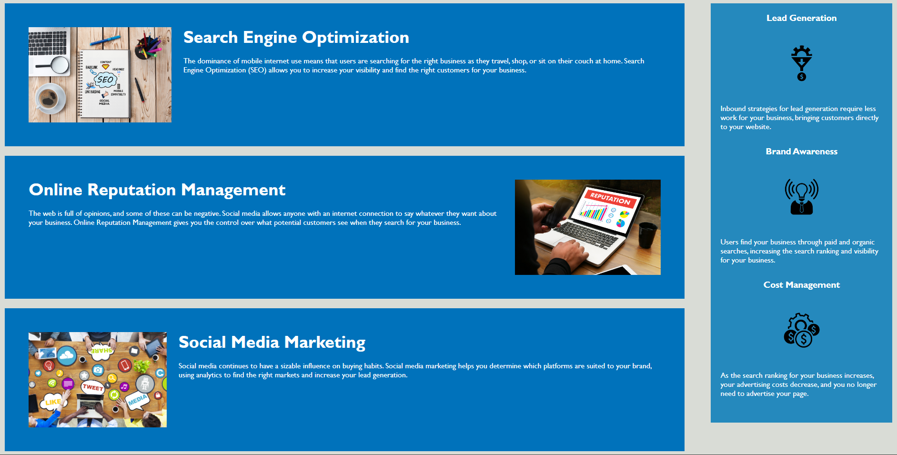

# Horiseon Marketing Solutions Services Application: Refactoring source code & adding accessiblity 

## Description

 <font size="2"> This application is built for a marketing service that includes a navigation bar with three topics that, when selected, scrolls to the respective section.</br>
 It also includes a brief summarization of the services that are offered and how these services can be useful to your brand. </br>
 There is a sidebar that displays strategies that will help you reach the goals you set for your brand's success.</br>

The refactored code includes standard accessibilty attributes, semantic HTML elements and logical structure.</br>

The link to the live application is  <a href="https://techmack92.github.io/horiseon-marketing-solution-services/" style="color:red">***HERE.***</font></a></br>

The following images show the web application's appearance and functionality:</font>



</br>


## User Story
```
AS A marketing agency
I WANT a codebase that follows accessibility standards
SO THAT our own site is optimized for search engines
```

## Acceptance Criteria
```
GIVEN a webpage meets accessibility standards
WHEN I view the source code
THEN I find semantic HTML elements
WHEN I view the structure of the HTML elements
THEN I find that the elements follow a logical structure independent of styling and positioning
WHEN I view the icon and image elements
THEN I find accessible alt attributes
WHEN I view the heading attributes
THEN they fall in sequential order
WHEN I view the title element
THEN I find a concise, descriptive title
```

## License
<font size="2"> Licensed under the <a href="https://github.com/techmack92/horiseon-marketing-solution-services/blob/main/LICENSE"> **MIT**</a> license.</font>
